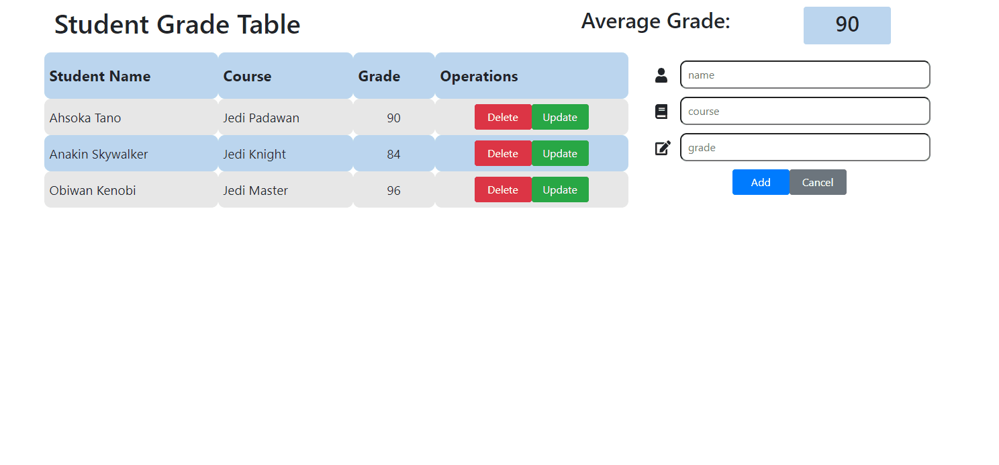

# Student Grade Table

The Student Grade Table: Written in React

## Introduction

The Student Grade Table is a dynamic web application for teachers who want to record the grades of their students.

# Technologies Used

* JavaScript
* React JS
* Node JS
* HTML5
* CSS3
* Bootstrap 4
* AWS EC2

# Features

* User can view all grades already recorded
* User can view average of all grades
* User can add new grades
* User can delete existing grade
* User can modify existing grade

# NPM Scripts

- `dev` - Start Webpack Dev Server on port `3000` and JSON Server on port `3001`. (Go to `http://localhost:3000`)
- `build` - Run Webpack to build the React client into `server/public`. (Usually only run during deployment)

# Preview



# Development
## System Requirements
* Node.js 10 or high
* npm 6 or higher

# Getting Started
1. Clone the respository.
```
git clonse https://github.com/AlexanderHeo/student_grade_table.git
cd student_grade_table
```
2. Install dependencies with npm.
```
npm install
```
3. Start the project.
```
npm run dev
```
4. Open <https://localhost:3000> in your brower
